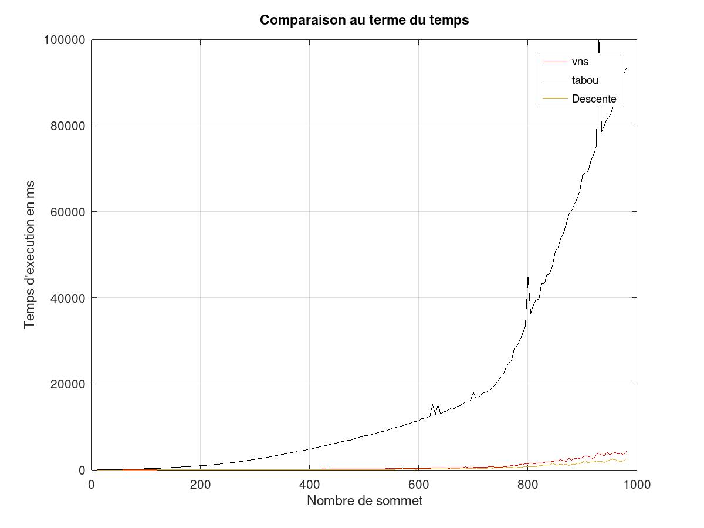
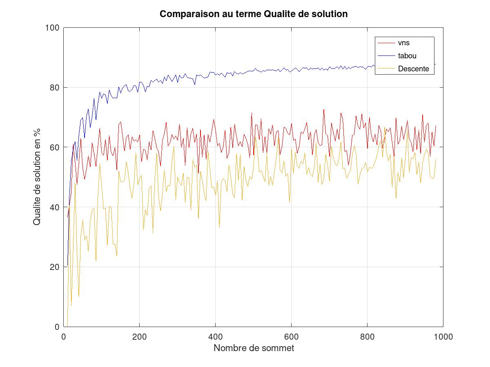

# tsp
Travral Selsman Problem solver

## Description:
The travelling salesman problem (also called the travelling salesperson problem or TSP) asks the following question: "Given a list of cities and the distances between each pair of cities, what is the shortest possible route that visits each city and returns to the origin city?" It is an NP-hard problem in combinatorial optimization, important in operations research and theoretical computer science. [more info](https://en.wikipedia.org/wiki/Travelling_salesman_problem)

In the following implemetation in Java we used:
 
* [Gradient Descent](https://en.wikipedia.org/wiki/Gradient_descent)
* [Tabu search](https://en.wikipedia.org/wiki/Tabu_search)
* [Simulated Annealing](https://en.wikipedia.org/wiki/Simulated_annealing)
* [VNS](https://en.wikipedia.org/wiki/Variable_neighborhood_search)

## comparaison between methods
based on random generated graph with multiple insances size, we created the following graph to compare in term of time, solution quality and costs.
 

* In term of time.
  

* In term of quality.
    

* In term of cost.
    